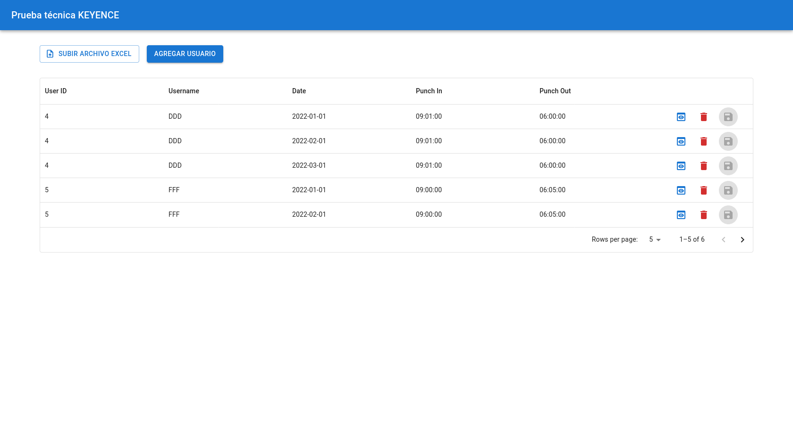
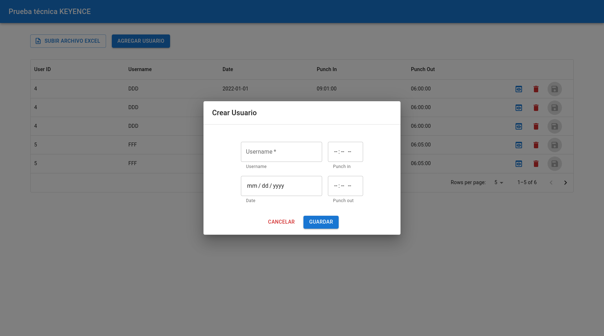
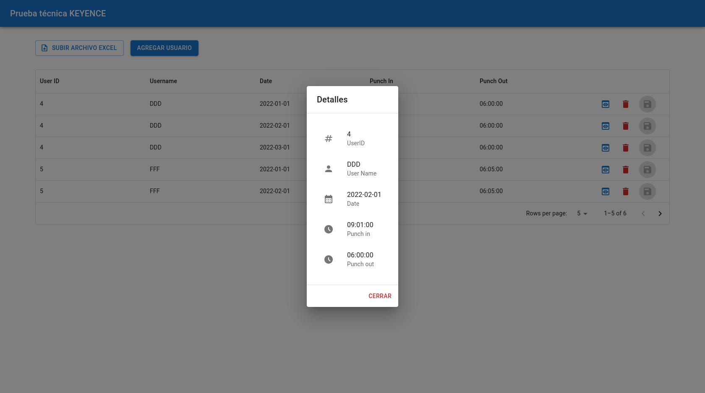

# frontend-prueba-keyence

---

## Dialog para crear un usuario

## Detalles de un usuario

- Se tomaron como PK el nombre del usuario y el campo date, por lo que estos no son editables.
- Campos editables
  - id
  - Punch in
  - Punch out
- Para editar basta con hacer doble click sobre la celda que se quiere editar.
